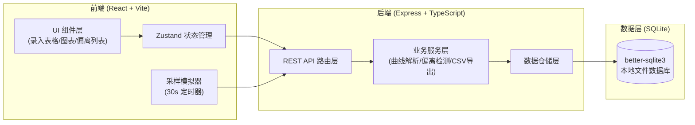
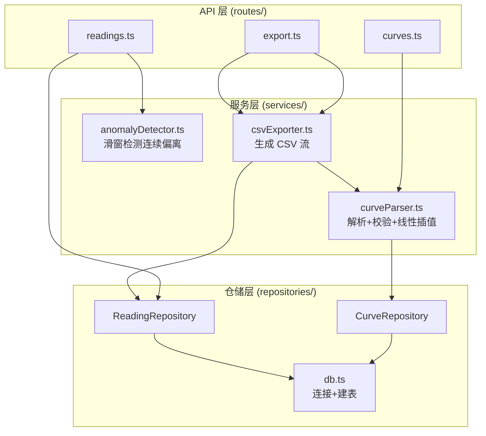
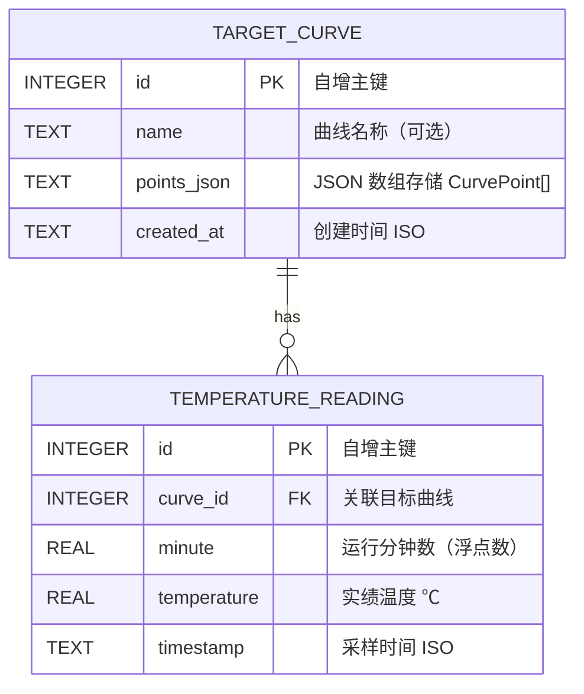

## 1. 架构设计



## 2. 技术描述
- **前端**：React@18 + TypeScript@5 + Vite@6 + TailwindCSS@3 + Zustand@5 + Chart.js@4 + react-chartjs-2@5 + Lucide React
- **后端**：Express@4 + TypeScript@5 + tsx（ESM 运行）+ better-sqlite3（同步 SQLite）
- **数据库**：SQLite 本地文件（`data/kiln.db`），zero-config，便于 Docker 打包
- **部署**：Docker + Docker Compose，前后端单容器或双容器 compose 启动
- **API 通信**：RESTful + JSON，CORS 全开便于开发

## 3. 目录结构

```
project/
├── api/                          # 后端代码
│   ├── routes/                   # API 路由层
│   │   ├── auth.ts
│   │   ├── curves.ts             # 目标曲线 CRUD
│   │   ├── readings.ts           # 实绩温度上报与查询
│   │   └── export.ts             # CSV 导出
│   ├── services/                 # 业务服务层（核心模块）
│   │   ├── curveParser.ts        # 模块一：曲线下达解析
│   │   ├── anomalyDetector.ts    # 模块二：偏离段检测
│   │   └── csvExporter.ts        # 模块三：CSV 导出
│   ├── repositories/             # 数据仓储层（模块四：实绩入库）
│   │   ├── db.ts                 # SQLite 连接与建表
│   │   ├── CurveRepository.ts
│   │   └── ReadingRepository.ts
│   ├── app.ts
│   ├── server.ts
│   └── index.ts
├── src/                          # 前端代码
│   ├── pages/
│   │   └── Home.tsx              # 主控台主页
│   ├── components/               # 模块五：图表与导出组件
│   │   ├── CurveInputTable.tsx   # 目标曲线录入表格
│   │   ├── TemperatureChart.tsx  # 温度折线图（含偏离标红）
│   │   ├── AnomalyList.tsx       # 偏离段侧栏列表
│   │   ├── ExportPanel.tsx       # 时间选择与导出面板
│   │   └── StatusBar.tsx         # 顶部实时状态
│   ├── store/
│   │   └── kilnStore.ts          # Zustand 状态管理
│   ├── types/
│   │   └── index.ts              # 共享类型定义
│   ├── hooks/
│   │   └── useKilnSampling.ts    # 30秒采样定时器 Hook
│   ├── lib/
│   ├── assets/
│   ├── App.tsx
│   ├── main.tsx
│   └── index.css
├── data/                         # SQLite 数据文件目录
│   └── kiln.db
├── Dockerfile                    # 前后端统一 Docker 镜像
├── docker-compose.yml
├── package.json
├── tailwind.config.js
├── vite.config.ts
└── tsconfig.json
```

## 4. 路由定义
| 前端路由 | 用途 |
|-------|---------|
| `/` | 主控台首页（唯一页面，SPA） |

| 后端 API 路由 | Method | 用途 |
|-------|--------|---------|
| `/api/health` | GET | 健康检查 |
| `/api/curves` | POST | 下达（创建）目标曲线 |
| `/api/curves/latest` | GET | 获取今日最新目标曲线 |
| `/api/curves/:id` | GET | 获取指定目标曲线 |
| `/api/readings` | POST | 上报一条实绩温度 |
| `/api/readings` | GET | 查询实绩列表（支持时间范围） |
| `/api/anomalies` | GET | 获取检测到的偏离段列表 |
| `/api/export/csv` | GET | 按时间范围导出 CSV |

## 5. API 类型定义

```typescript
// 共享类型定义

export interface CurvePoint {
  minute: number;   // 时间点，单位：分钟（从 0 开始）
  temperature: number;  // 目标温度，单位：℃
}

export interface TargetCurve {
  id: number;
  name?: string;
  points: CurvePoint[];
  createdAt: string;  // ISO 时间戳
}

export interface TemperatureReading {
  id: number;
  curveId: number;
  minute: number;       // 采样时的运行分钟数（含小数，如 1.5 = 90秒）
  temperature: number;  // 实绩温度 ℃
  timestamp: string;    // 实际采样时间 ISO
}

export interface AnomalySegment {
  id?: string;          // 临时唯一标识
  startMinute: number;  // 偏离起始分钟
  endMinute: number;    // 偏离结束分钟
  startIndex: number;   // readings 数组起始索引
  endIndex: number;     // readings 数组结束索引
  maxDeviation: number; // 最大偏差绝对值 ℃
  pointCount: number;   // 偏离采样点数
}

export interface ExportRow {
  minute: number;
  targetTemp: number | null;
  actualTemp: number;
  isAnomaly: boolean;
  deviation: number | null;
}
```

### 请求/响应 Schema
**POST /api/curves**
```json
{ "points": [{ "minute": 0, "temperature": 20 }, { "minute": 60, "temperature": 800 }] }
→ { "success": true, "data": { "id": 1, "points": [...], "createdAt": "..." } }
```

**POST /api/readings**
```json
{ "curveId": 1, "minute": 1.5, "temperature": 42.3 }
→ { "success": true, "data": { "id": 101, ... } }
```

**GET /api/readings?curveId=1&fromMinute=0&toMinute=120**
```json
→ { "success": true, "data": TemperatureReading[] }
```

**GET /api/anomalies?curveId=1**
```json
→ { "success": true, "data": AnomalySegment[] }
```

**GET /api/export/csv?curveId=1&fromMinute=0&toMinute=120**
→ 响应头 `Content-Disposition: attachment; filename=kiln-export-xxx.csv`

## 6. 服务器内部架构



## 7. 数据模型

### 7.1 ER 图


### 7.2 DDL
```sql
-- 目标曲线表
CREATE TABLE IF NOT EXISTS target_curve (
  id INTEGER PRIMARY KEY AUTOINCREMENT,
  name TEXT,
  points_json TEXT NOT NULL,
  created_at TEXT NOT NULL DEFAULT (datetime('now'))
);

-- 实绩温度表
CREATE TABLE IF NOT EXISTS temperature_reading (
  id INTEGER PRIMARY KEY AUTOINCREMENT,
  curve_id INTEGER NOT NULL,
  minute REAL NOT NULL,
  temperature REAL NOT NULL,
  timestamp TEXT NOT NULL DEFAULT (datetime('now')),
  FOREIGN KEY (curve_id) REFERENCES target_curve(id) ON DELETE CASCADE
);

-- 索引：按曲线+时间快速查询
CREATE INDEX IF NOT EXISTS idx_reading_curve_minute 
  ON temperature_reading(curve_id, minute);
```

## 8. 核心算法说明

### 8.1 曲线解析与插值（curveParser.ts）
- 输入：值班员录入的离散点 `[{minute, temperature}, ...]`
- 校验：时间点必须严格递增，温度在合理范围（0-1400℃）
- 给定任意分钟数 `m`，通过**线性插值**计算目标温度：
  - 找到 `m` 所在区间 `[prevMinute, nextMinute]`
  - `targetTemp = prevTemp + (nextTemp - prevTemp) * (m - prevMinute) / (nextMinute - prevMinute)`
  - `m < 首点` 返回首点温度；`m > 末点` 返回末点温度

### 8.2 偏离检测（anomalyDetector.ts）
- 输入：按分钟排序的实绩采样数组
- 算法：**滑动窗口 + 连续计数**
  - 遍历每个采样点，计算与目标温度的偏差绝对值
  - 若偏差 > 25℃，连续计数 +1；否则计数归零
  - 当连续计数 ≥ 3 时，标记为偏离段，记录起始位置
  - 当连续计数归零且上一段是偏离时，关闭该偏离段并计算最大偏差
- 输出：`AnomalySegment[]`

### 8.3 CSV 导出（csvExporter.ts）
- 按时间范围查询所有实绩点
- 对每个点插值计算目标温度，判定是否处于偏离段
- 输出列：`minute,targetTemp,actualTemp,deviation,isAnomaly`
- 表头中文注释，UTF-8 BOM 防 Excel 乱码
