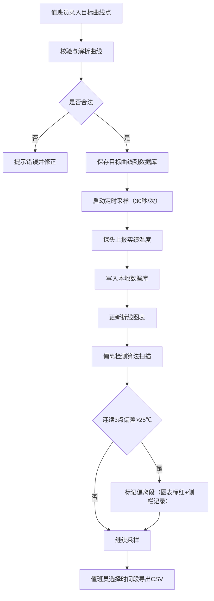

## 1. 产品概述

制陶作坊窑炉房还原焰升温曲线监控系统，用于值班员录入今日目标升温曲线，实时比对窑炉实绩温度与目标值，自动检测偏离段并支持数据导出。

- **核心目标**：确保窑炉温度按工艺曲线精确运行，及时发现偏离并记录异常
- **目标用户**：制陶作坊值班员、工艺管理员
- **产品价值**：提升烧成品质一致性，减少废品率，留存工艺数据便于追溯

## 2. 核心功能

### 2.1 功能模块
1. **目标曲线录入**：值班员录入多组时间点（分钟）与对应窑温（℃），系统解析并保存为当日目标曲线
2. **实绩采集**：窑侧探头每 30 秒自动上报一次实绩温度，写入本地存储
3. **曲线可视化**：叠加绘制目标折线与实绩折线，直观比对
4. **偏离检测**：实绩连续 3 个采样点偏离目标超过 25℃ 时，该段标红并在侧栏列出起止分钟
5. **数据导出**：支持选定时间段导出 CSV（时间、目标、实绩、是否偏离）

### 2.2 页面详情
| 页面名称 | 模块名称 | 功能描述 |
|-----------|-------------|---------------------|
| 主控台首页 | 目标曲线录入表格 | 动态增删时间点行，输入分钟与温度值，一键下达保存 |
| 主控台首页 | 温度曲线图 | Chart.js 双折线叠加，偏离段以红色高亮绘制 |
| 主控台首页 | 偏离段侧栏 | 列出所有检测到的偏离段（起止分钟、持续时长、最大偏差） |
| 主控台首页 | 时间范围选择器 + 导出按钮 | 选择起止分钟后导出 CSV 文件 |
| 主控台首页 | 实时状态面板 | 显示当前温度、目标温度、偏差值、采样进度 |

## 3. 核心流程

### 3.1 值班员操作流程
1. 值班员打开系统主页
2. 在目标曲线录入表格中逐行输入时间点（分钟）与目标温度（℃）
3. 点击「下达曲线」，系统校验时间递增且温度合理后保存
4. 系统启动模拟探头，每 30 秒上报一次实绩温度
5. 曲线图实时刷新，叠加显示目标与实绩
6. 系统后台持续检测偏离段，发现后标红图表并在侧栏显示
7. 值班员选择时间段，点击「导出 CSV」获取报表

### 3.2 流程图

## 4. 用户界面设计

### 4.1 设计风格
- **设计方向**：工业/窑炉风（Industrial / Kiln Aesthetic）——深色背景配暖橙红色调，传达高温窑炉的工业质感
- **主色调**：深炭灰 `#1a1410`（背景）、耐火橙 `#ff6b35`（主色）、警示红 `#e63946`（偏离告警）
- **辅助色**：钢青 `#457b9d`（目标曲线）、琥珀黄 `#f4a261`（实绩曲线）
- **字体**：标题使用粗体工业风字体，正文使用清晰无衬线字体
- **按钮风格**：方形带轻微圆角，实心填充 + hover 发光效果
- **布局风格**：三栏式布局（左侧目标录入 + 中间图表 + 右侧偏离列表），顶部状态栏
- **图标**：Lucide 图标库，火焰、温度计、告警等工业图标

### 4.2 页面设计概述
| 页面名称 | 模块名称 | UI 元素 |
|-----------|-------------|-------------|
| 主控台首页 | 顶部状态栏 | 当前温度大数字显示、目标温度、偏差值（正负色）、运行时长、采样计数 |
| 主控台首页 | 左侧录入区 | 卡片式容器，表格行增删按钮，「下达曲线」主操作按钮 |
| 主控台首页 | 中间图表区 | 大尺寸折线图容器，图例、坐标轴标签，偏离段红色背景带 |
| 主控台首页 | 右侧偏离列表 | 滚动列表卡片，每条显示起止分钟、时长、最大偏差、状态徽章 |
| 主控台首页 | 底部导出区 | 时间范围输入（起止分钟）、导出按钮、下载状态提示 |

### 4.3 响应式
- 桌面优先设计（≥1280px），三栏并排
- 平板（768-1280px）：左栏折叠为可展开抽屉，中图右列表上下排列
- 移动（<768px）：垂直堆叠，图表为主视图，其他模块折叠为卡片

### 4.4 动效细节
- 页面加载：各模块淡入 + 从底部轻微上浮，错峰 100ms 依次出现
- 温度数字变化：数字滚动过渡动画
- 偏离段出现：红色闪烁脉冲 2 次后稳定显示
- 采样心跳：状态栏小圆点每 30 秒脉冲一次绿色
- 按钮 hover：边框发光 + 轻微放大
